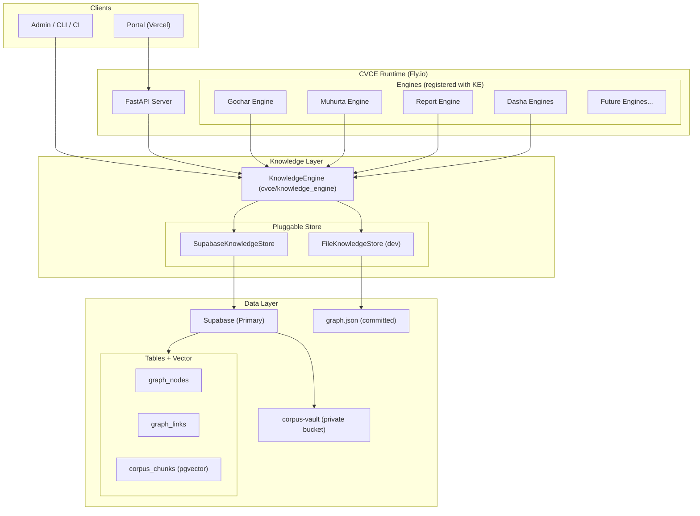
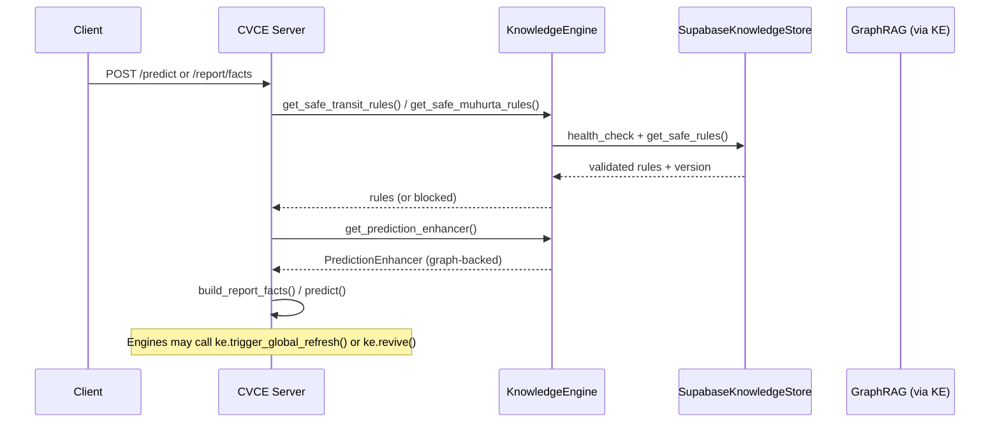

# KnowledgeEngine Architecture (Final)

**Date:** 2026-06-29  
**Status:** Supabase is the default backend. KnowledgeEngine is the single source of truth.

---

## High-Level Architecture



---

## Detailed Runtime Flow



---

## Key Components

| Component                        | Responsibility                                      | File |
|----------------------------------|-----------------------------------------------------|------|
| `KnowledgeEngine`                | Central owner, health, invalidation, revival, cascade | `engine.py` |
| `SupabaseKnowledgeStore`         | Secure DB access + vector search                    | `store/supabase_store.py` |
| `EngineRegistry`                 | Tracks dependent engines + callbacks                | `registry.py` |
| `integration.py`                 | Safe public API used by the rest of the system      | `integration.py` |
| `trigger_global_refresh()`       | Force refresh across all engines                    | `engine.py` + `/knowledge/refresh` |
| `on_new_literature_ingested()`   | Cascade hook called by ingestion scripts            | `engine.py` |

---

## Security Model

- All database access goes through `SupabaseKnowledgeStore`
- Service role key is used, but encapsulated
- Future improvements:
  - Dedicated `KNOWLEDGE_ENGINE_KEY`
  - Request logging + audit
  - Per-engine permissions

---

## Refresh & Cascade Mechanism

1. New texts ingested → `merge --promote`
2. Ingestion script calls `KE.on_new_literature_ingested(...)`
3. `KnowledgeEngine` updates version + notifies all registered engines
4. Engines implement `on_refresh()` to drop caches and rebuild

Alternatively, anyone can call:

```
POST /knowledge/refresh
```

to force a global recalculation.

---

*This architecture cleanly separates astronomical calculation (PyJHora) from classical Vedic knowledge (Knowledge Graph via KnowledgeEngine).*