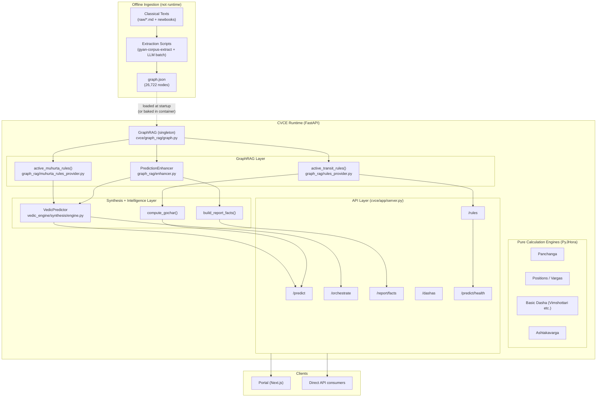
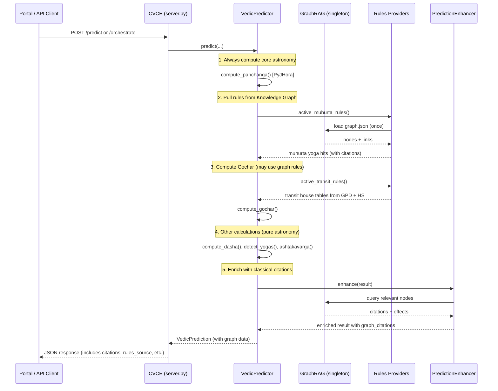
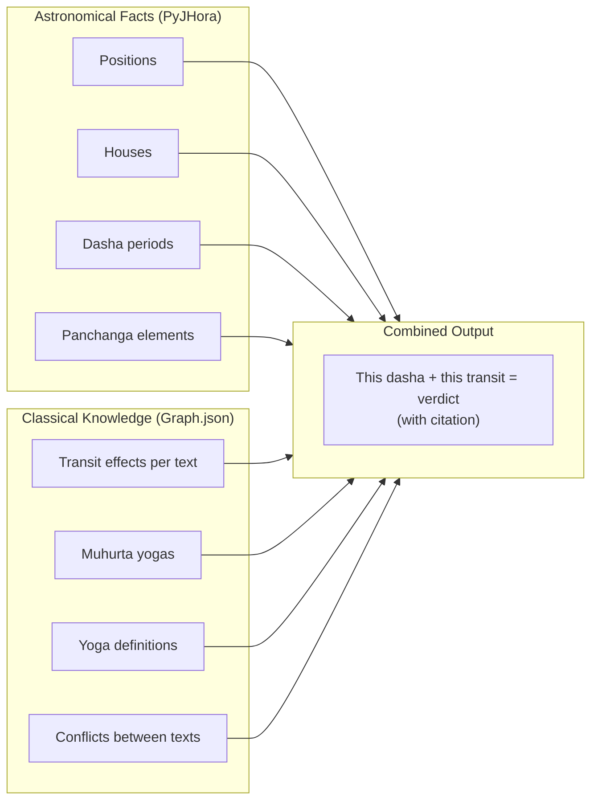

# Knowledge Graph → Engines Connection (Runtime Flow)

This document shows exactly how the Knowledge Graph is wired into the various engines.

---

## 1. High-Level Architecture

---

## 2. Detailed Runtime Flow (Most Important)

---

## 3. Where the Graph Is Actually Used

| Component                        | File                                      | How it uses the Knowledge Graph                          | Output to caller                  |
|----------------------------------|-------------------------------------------|----------------------------------------------------------|-----------------------------------|
| `active_transit_rules()`         | `graph_rag/rules_provider.py`             | Reads GPD + Hora Sara nodes for planet-in-house effects  | Transit verdict tables + sources  |
| `active_muhurta_rules()`         | `graph_rag/muhurta_rules_provider.py`     | Reads Vara/Tithi/Nakshatra yoga nodes                    | Matching classical yogas          |
| `PredictionEnhancer.enhance()`   | `graph_rag/enhancer.py`                   | Full graph search for citations, conflicts, god nodes    | `transit_citations`, `yoga_citations`, etc. |
| `VedicPredictor.predict()`       | `vedic_engine/synthesis/engine.py`        | Calls muhurta rules + passes data to enhancer            | Enriched prediction object        |
| `compute_gochar()`               | `vedic_engine/prediction/gochar.py`       | Uses `active_transit_rules()` when enabled               | Gochar result with graph backing  |
| `build_report_facts()`           | `app/report_facts.py`                     | Uses `PredictionEnhancer`                                | Full report with citations        |
| `/predict`, `/orchestrate`       | `app/server.py`                           | Exposes graph-enriched data + `rules_source`             | API response                      |
| `/rules`, `/rules/{category}`    | `app/server.py`                           | Direct access to graph rules                             | Raw or filtered rules             |

---

## 4. Key Points

- The **Knowledge Graph is the source of classical Vedic laws and interpretations**.
- The **calculation engines** (PyJHora) provide the astronomical facts.
- The **GraphRAG layer** sits *on top* and supplies the "what the texts say about these facts".
- It is **not** a standalone module — it is actively injected into:
  - Transit / Gochar
  - Muhurta
  - Report generation
  - Direct rule queries
- Control is via environment variable `CVCE_GRAPH_AS_RULES` (default = true in production).

---

## 5. Data vs Computation Separation

This separation is intentional: calculations stay deterministic and precise; reasoning and classical authority come from the curated knowledge graph.

---

*Generated from actual code paths in `cvce/graph_rag/`, `vedic_engine/`, and `app/server.py` as of 2026-06-29.*
